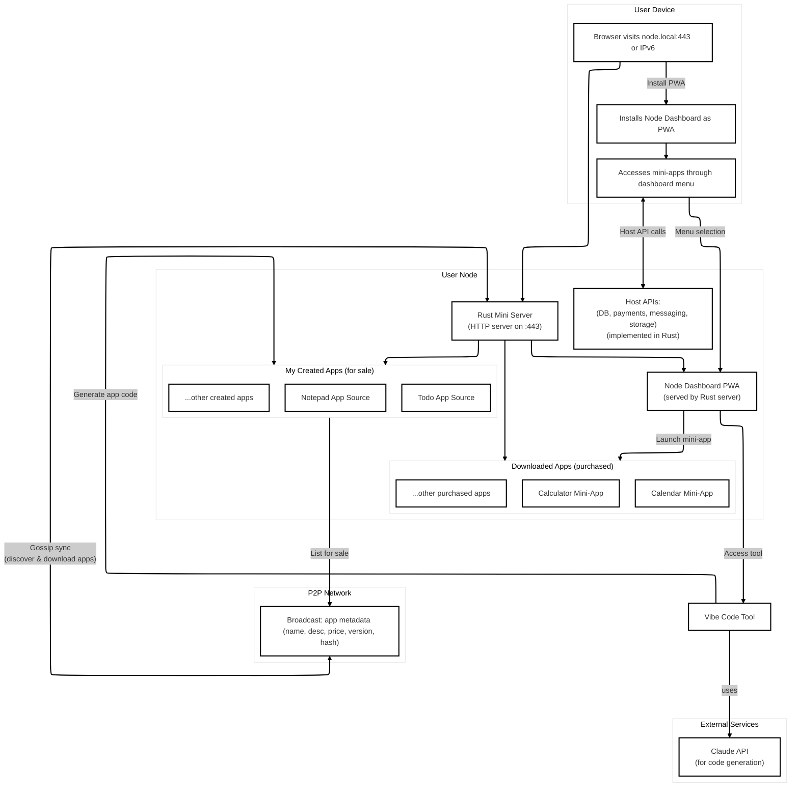

# P2P Store

A peer-to-peer web store application. This project allows users to buy and sell items directly through a decentralized web interface.

## The Prototype

- The store is a **standalone `store.html` file**. Double-click to open in your default browser.
- The app list is loaded from a **dummy SQLite database** and rendered using **React**.
- Each app listing includes a **Pay button** powered by **LDK** (Lightning Development Kit).

## Architecture



- Each app is a self-contained "mini-app" served by the user's personal **Rust Mini Server**.
- Apps interact with a set of stable **Host APIs** (also implemented in Rust) for functionalities like database, payments, and storage, instead of receiving them as component props.
- The main "Node Dashboard" is a PWA that launches these mini-apps, potentially using a microfrontend-style architecture.

### Prerequisites

- Node.js (recommended v18+)
- pnpm

### Installation

Clone the repository:

```bash
git clone https://github.com/yourusername/p2p-store.git
cd p2p-store
```

Install dependencies:

```bash
pnpm install
```

### Development

This will start the server on `http://localhost:5173`.

#### Debugging in VS Code

1.  Go to the "Run and Debug" view in VS Code (Shift+Cmd+D or Shift+Ctrl+D).
2.  Select "Launch Chrome against localhost" from the dropdown and click the green play button.
3.  This will automatically start the development server and open a new Chrome window connected to the debugger. You can now set breakpoints in your `.tsx` files within VS Code.

### Build

To build the project:

```bash
pnpm build
```

The P2P Store will be compiled into static resources in the `output` folder, which can then be hosted on a web server. The web server must support `COOP` and `COEP` headers. The simplest way to check this is to use the following command:

```bash
pnpm preview
```

### Usage

Open `store.html` in your browser to use the P2P Store. The app list will be displayed, and you can use the Pay button for each app.

## Contributing

Pull requests are welcome. For major changes, please open an issue first to discuss what you would like to change.

## License

MIT
